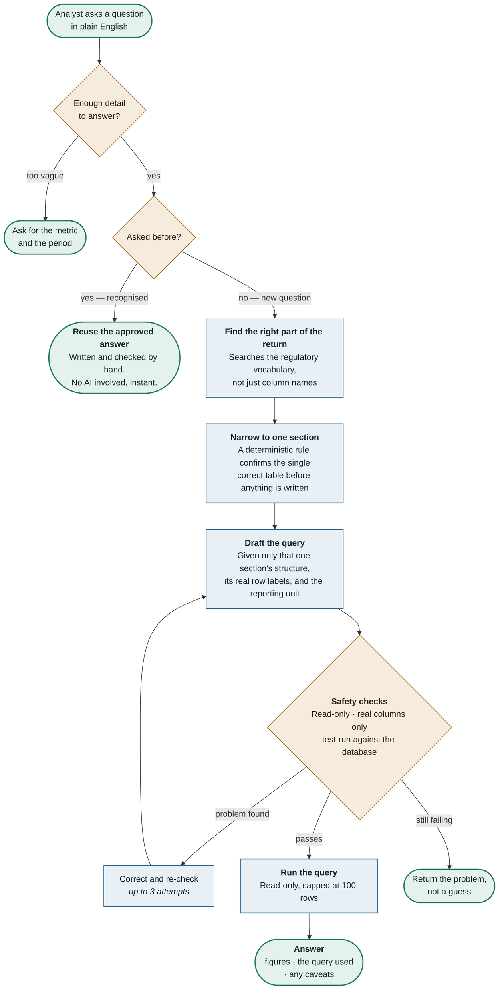
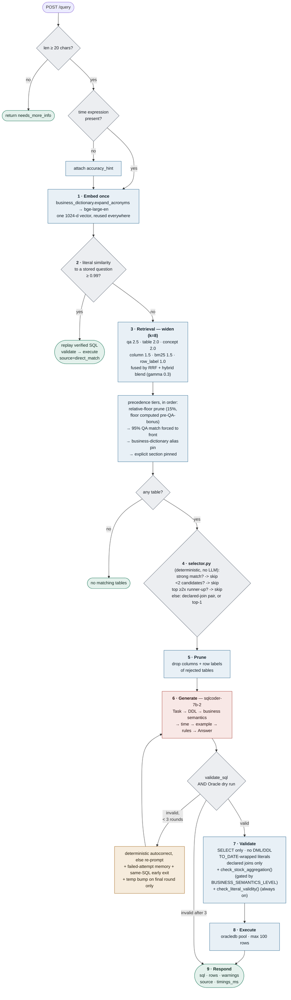
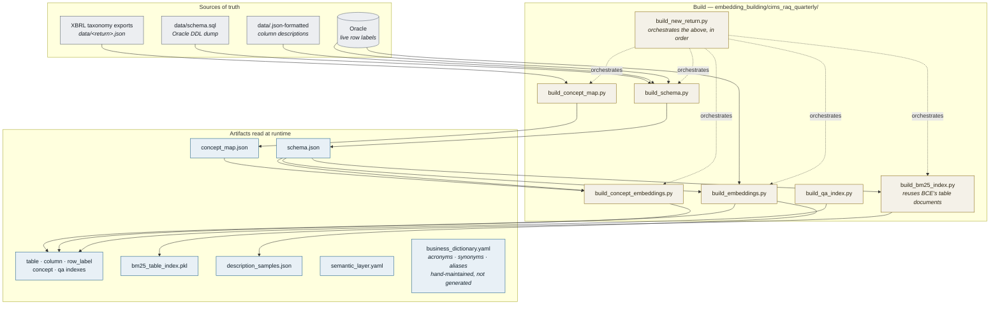

# Architecture Diagrams

Natural language → SQL pipeline for RBI CIMS regulatory returns (RAQ, ALE), Oracle backend. Diagrams are Mermaid; they render on GitHub and in most Markdown viewers.

**Note on table selection:** `src/selector.py` is fully deterministic today and makes no LLM call — an earlier LLM-based version (`qwen2.5-coder:7b` via the Ollama proxy) was tried and removed because a single call cost 75–135s+. The diagrams below reflect the current deterministic implementation, not the earlier design.

---

## 1. Component architecture

```mermaid
graph TB
    subgraph CLIENT["Client — React 18 + Vite 5 + Tailwind 3"]
        UI["Home page<br/><i>frontend/src/pages/Home</i>"]
        COMP["QueryInput · SqlDisplay<br/>ResultsTable · StatusBadge · TimingsPanel"]
        APIJS["api.js<br/><i>fetch wrapper</i>"]
        UI --> COMP --> APIJS
    end

    subgraph API["API — FastAPI + Uvicorn (CORS :5173)"]
        MAIN["main.py<br/><i>startup, router registration</i>"]
        QROUTE["routes/query.py<br/><b>POST /query</b> — orchestrator"]
        HROUTE["routes/health.py<br/>GET /health, GET /test-db"]
        SCHEMAS["schemas.py<br/><i>QueryRequest / QueryResult</i>"]
        MAIN --> QROUTE
        MAIN --> HROUTE
        QROUTE -.validates via.-> SCHEMAS
    end

    subgraph CORE["Pipeline core — src/"]
        RETR["retriever.py<br/><i>7-signal RRF fusion + hybrid blend<br/>+ precedence tiers</i>"]
        SEL["selector.py<br/><i>deterministic shortlist → 1 table<br/>NO network call</i>"]
        GEN["sql_generator.py<br/><i>prompt build · correction loop · validate</i>"]
        EXEC["executor.py<br/><i>oracledb pool · dry run · execute</i>"]
        VEC["vectorizer.py<br/><i>SentenceTransformer wrapper</i>"]
        CM["concept_map.py<br/><i>XBRL business layer +<br/>check_stock_aggregation()</i>"]
        LV["literal_validator.py<br/><i>check_literal_validity()</i>"]
        BS["business_semantics.py<br/><i>prompt block renderer</i>"]
        SEML["semantic_layer.py<br/><i>join allow-list</i>"]
        SECA["section_alias.py<br/><i>'Section 12' → table</i>"]
        BD["business_dictionary.py<br/><i>acronyms · synonyms · alias pins</i>"]
        LEX["lexical_search.py<br/><i>BM25 signal</i>"]
        DESC["description_fetcher.py<br/><i>row-label samples</i>"]
        CFG["config.py<br/><i>all env-driven settings</i>"]
    end

    subgraph MODELS["Models"]
        EMB["<b>bge-large-en</b> · 1024-d<br/>sentence-transformers<br/><i>LOCAL, in-process</i>"]
        SQLM["<b>sqlcoder-7b-2</b> Q5_K_M<br/><i>REMOTE via Ollama — the only LLM call</i>"]
    end

    subgraph STORE["Stores"]
        FAISS["FAISS IndexFlatIP · faiss-cpu<br/>table · column · row_label<br/>qa · concept<br/><i>+ .pkl payload sidecars</i>"]
        ARTI["schema.json · concept_map.json<br/>semantic_layer.yaml<br/>qa_pairs.json · description_samples.json"]
        ORA[("Oracle<br/><i>RAQ + ALE tables</i>")]
    end

    subgraph PROXY["Ollama proxy"]
        OP["/OllamaProxy/api/generate"]
    end

    APIJS ==>|"HTTP JSON"| QROUTE

    QROUTE ==> RETR
    QROUTE ==> SEL
    QROUTE ==> GEN
    QROUTE ==> EXEC

    RETR --> VEC
    RETR --> SECA
    RETR --> DESC
    RETR --> BD
    RETR --> LEX
    SEL --> SEML
    GEN --> BS
    BS --> CM
    GEN --> SEML
    GEN --> CM
    GEN --> LV
    LV --> DESC

    VEC ==> EMB
    GEN ==>|"HTTP, only network call in the request path"| OP
    OP ==> SQLM

    RETR --> FAISS
    CM --> ARTI
    GEN --> ARTI
    SEML --> ARTI
    BD --> BDY["business_dictionary.yaml"]
    LEX --> BM25I["bm25_table_index.pkl"]
    EXEC ==>|"python-oracledb<br/>thin mode, pooled"| ORA

    QROUTE -.->|"result.warnings, timings_ms"| SCHEMAS

    CFG -.->|"read at call time"| RETR
    CFG -.-> SEL
    CFG -.-> GEN
    CFG -.-> EXEC

    classDef client fill:#e8f0f6,stroke:#1d5f8a,color:#12202b
    classDef api fill:#e4f1ec,stroke:#1f7a5c,color:#0f2b22
    classDef core fill:#f4f1e8,stroke:#8a6d1d,color:#2b2412
    classDef model fill:#f8e8e6,stroke:#a4342b,color:#2b1210
    classDef store fill:#eceef1,stroke:#5a6472,color:#1a1f26
    classDef proxy fill:#f6ecdd,stroke:#9c5c0c,color:#2b1f0c

    class UI,COMP,APIJS client
    class MAIN,QROUTE,HROUTE,SCHEMAS api
    class RETR,SEL,GEN,EXEC,VEC,CM,LV,BS,SEML,SECA,BD,LEX,DESC,CFG core
    class EMB,SQLM model
    class FAISS,ARTI,ORA,BDY,BM25I store
    class OP proxy
```

---

## 2. Model touchpoints

Exactly one remote LLM call exists in the request path (plus its correction retries) — table selection is deterministic and makes no model call at all.

```mermaid
graph LR
    Q["User question"]

    subgraph LOCAL["Runs in the API process"]
        E["<b>bge-large-en</b><br/>SentenceTransformer<br/>1024-d, L2-normalised<br/>~100ms CPU"]
    end

    subgraph DETERM["Deterministic — no model, no network call"]
        SELD["selector.py<br/>strong-match / dominance-ratio /<br/>declared-join / top-1 fallback"]
    end

    subgraph REMOTE["Remote — one model"]
        G["<b>sqlcoder-7b-2:Q5_K_M</b><br/><i>completion</i> — writes SQL only<br/>temp 0 · up to 3 correction retries"]
    end

    Q -->|"business_dictionary.expand_acronyms()<br/>npa → non performing assets"| E
    E -->|"ONE vector,<br/>reused across every signal"| F["7 signals (5 FAISS + concept + BM25)<br/>= RRF fusion + hybrid blend (gamma 0.3)"]
    F -->|"shortlist"| SELD
    SELD -->|"1 table (or 2 via declared join)"| G
    G -->|"SQL"| V["validate + Oracle dry run<br/>+ stock/flow + literal-validity checks"]
    V -->|"invalid, ≤3 rounds"| G

    classDef local fill:#e4f1ec,stroke:#1f7a5c,color:#0f2b22
    classDef determ fill:#eceef1,stroke:#5a6472,color:#1a1f26
    classDef remote fill:#f8e8e6,stroke:#a4342b,color:#2b1210
    classDef flow fill:#eceef1,stroke:#5a6472,color:#1a1f26

    class E local
    class SELD determ
    class G remote
    class Q,F,V flow
```

---

## 3. How a question becomes an answer

Non-technical overview. Every question passes safeguards before any data is read, and questions we have answered before skip the AI entirely.

**What this buys us**

| | |
|---|---|
| **Repeat questions are free** | A recognised question replays an answer a human already verified — no AI, no cost, no risk of a different answer next time. |
| **The AI is never given a free hand** | It sees one section of the return, that section's real row labels, and nothing else. |
| **Nothing is written, ever** | Read-only by design, enforced before execution, not by convention. |
| **Wrong beats invented** | If the query cannot be made valid in three attempts, the system reports the problem instead of returning a plausible number. |
| **Every answer is auditable** | The query used is returned alongside the figures, so any number can be traced back to the exact rows it came from. |

---

## 4. Same flow, engineering detail

---

## 5. Offline build vs runtime read

Nothing in the request path writes. Every artifact is built ahead of time; the API only reads. See **[EMBEDDING_GUIDE.md](EMBEDDING_GUIDE.md)** for the full build pipeline.

The API caches indexes and artifacts for the life of the process — a rebuild alone will not be picked up; the API process must be restarted.
