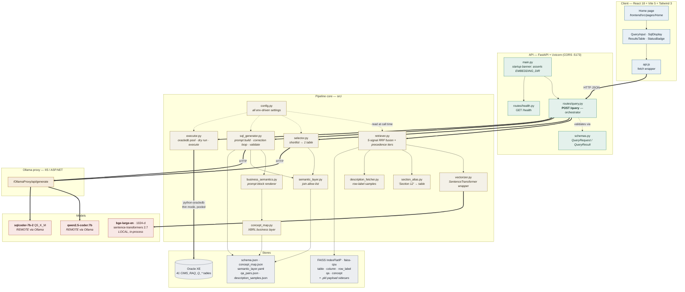
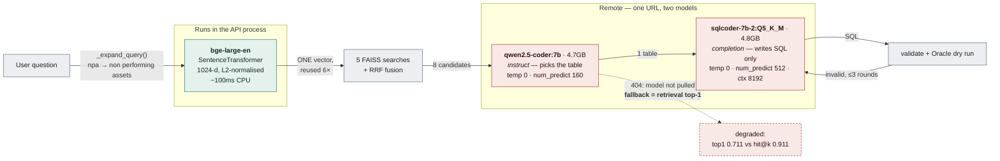
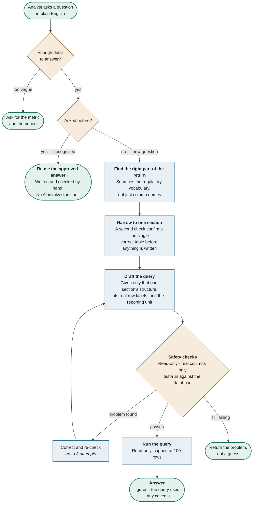
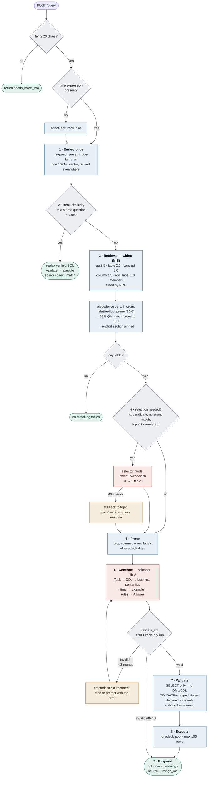
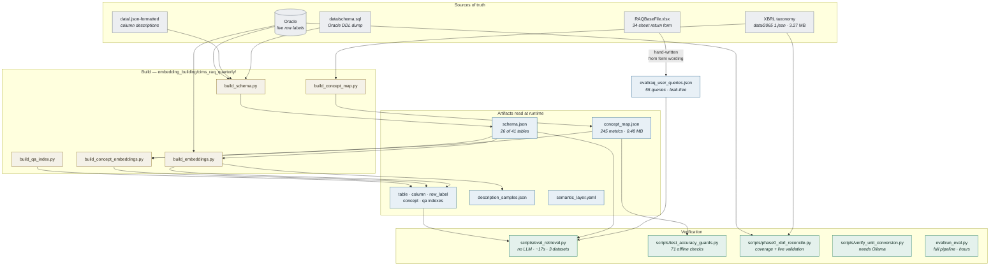

# Architecture Diagrams

Natural language → SQL pipeline for RBI CIMS/RAQ return 2065 (Oracle backend).
Diagrams are Mermaid; they render on GitHub and in most Markdown viewers.

---

## 1. Component architecture



---

## 2. Model touchpoints

Both remote models share one URL and differ only by the `model` field in the
payload — which is why an unpulled selector model surfaces as a 404 while SQL
generation keeps working.



---

## 3. How a question becomes an answer

Non-technical overview. Every question passes three safeguards before any data is
read, and questions we have answered before skip the AI entirely.



**What this buys us**

| | |
|---|---|
| **Repeat questions are free** | A recognised question replays an answer a human already verified — no AI, no cost, no risk of a different answer next time. |
| **The AI is never given a free hand** | It sees one section of the return, that section's real row labels, and nothing else. It cannot reach data it was not given. |
| **Nothing is written, ever** | Read-only by design, enforced before execution, not by convention. |
| **Wrong beats invented** | If the query cannot be made valid in three attempts, the system reports the problem instead of returning a plausible number. |
| **Every answer is auditable** | The query used is returned alongside the figures, so any number can be traced back to the exact rows it came from. |

---

## 3b. Same flow, engineering detail



---

## 4. Offline build vs runtime read

Nothing in the request path writes. Every artifact is built ahead of time; the
API only reads.



Rebuild order — each step reads the previous one's output:

```
build_schema.py → build_concept_map.py → build_embeddings.py → build_concept_embeddings.py
                                                                ↳ then restart the API
```

The API caches indexes and artifacts for the life of the process, and uvicorn's
reloader watches `api/` and `src/` but **not** `embedding_building/` — a rebuild
alone will not be picked up.
